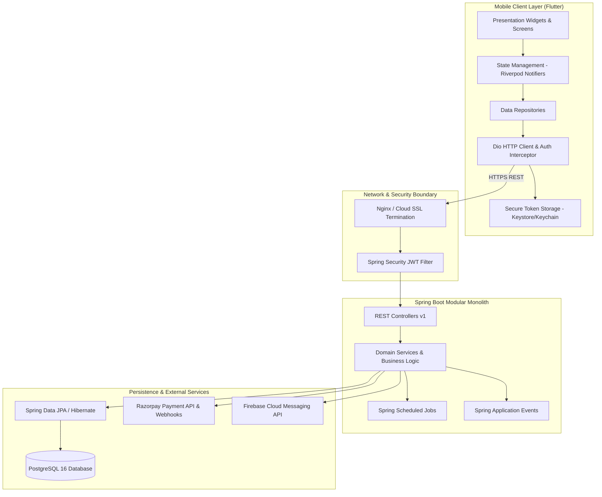

# Digital Library Management System - Architecture Overview

## 1. Architectural Philosophy: The Modular Monolith

For a physical library operating with 50 study desks and 100–500 active students, microservices architecture introduces severe, unjustifiable costs:
- Distributed transactions (Saga pattern) across seat reservations and payments.
- Network latency and serialization overhead.
- Operational complexity (orchestrators, service meshes, distributed tracing, high cloud hosting bills).

Instead, this system adopts a **Modular Monolith** architecture:
- **Single deployable unit:** High operational simplicity and fast local development.
- **Strict internal boundaries:** Each domain feature (Auth, Seat, Admission, Subscription, Payment, Attendance, Notification) is encapsulated in its own package with clear service interfaces and DTOs.
- **Relational transaction integrity:** Atomic database transactions across seat status updates, payments, and subscriptions ensure 100% ACID guarantees.
- **Multi-Tenant Ready:** Every domain entity maintains a `library_id` foreign key, allowing seamless evolution into a SaaS model for multiple library branches in the future.

---

## 2. High-Level System Layers

---

## 3. Technology Stack Rationale

| Layer | Selected Technology | Alternative Considered | Key Architectural Justification |
|---|---|---|---|
| **Mobile Client** | **Flutter & Dart** | React Native, Kotlin | Single codebase for Android & iOS; high performance rendering 2D seat layouts with 60 FPS; robust offline capabilities. |
| **Mobile State** | **Riverpod** | Bloc, Provider | Compile-time safety; zero BuildContext dependency in business logic; excellent testability and state scoping. |
| **Backend** | **Spring Boot (Java 25/21)** | Django, Node.js/Express | Mature transactional ecosystem; type-safe entity modeling; rock-solid scheduled background jobs; enterprise security filters. |
| **Database** | **PostgreSQL** | MySQL, MongoDB | Strict relational integrity; row-level locking (`FOR UPDATE`) for race-free seat reservations; native JSONB support for audit changes; ACID compliance. |
| **Payment Gateway**| **Razorpay** | Stripe, Cashfree | Native UPI intent flow on Indian Android devices; reliable webhook infrastructure; low failure rate in India. |
| **Push Alerts** | **Firebase Cloud Messaging** | OneSignal | Direct Android OS integration, zero additional service cost, high delivery reliability. |
