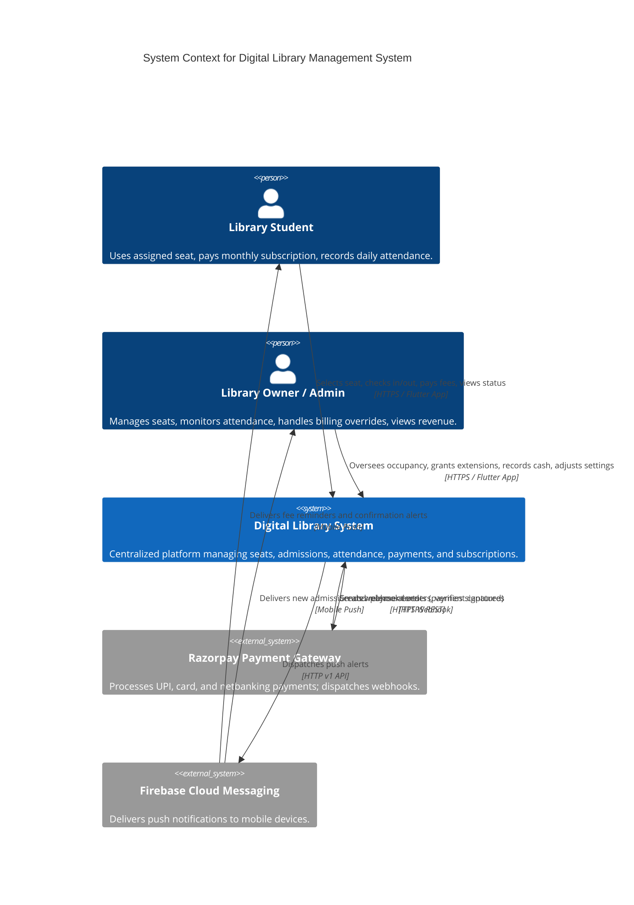
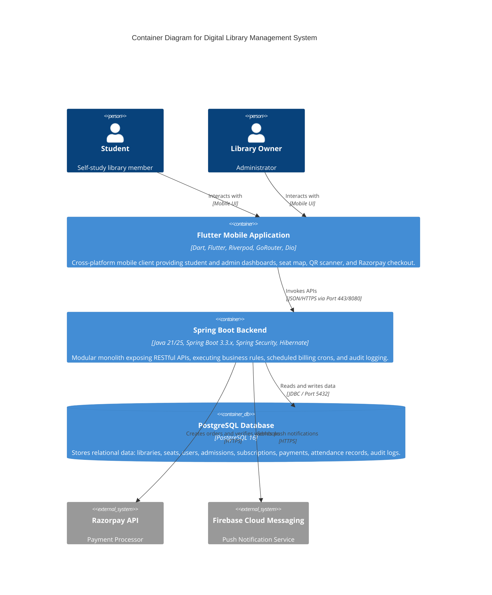
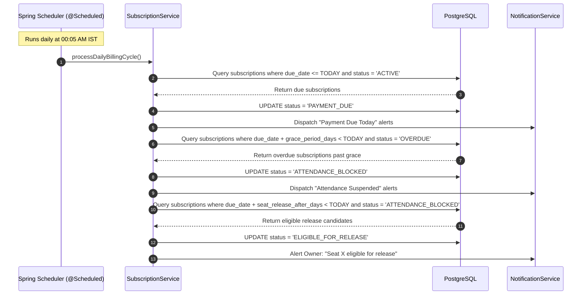

# Digital Library Management System - High-Level Design (HLD)

## 1. System Context Diagram (C4 Level 1)



---

## 2. Container Diagram (C4 Level 2)



---

## 3. Core Component Interactions

### 3.1 Concurrency & Seat Locking Flow
```mermaid
sequenceDiagram
    autonumber
    actor User1 as Student 1
    actor User2 as Student 2
    participant API as Spring Boot API
    participant DB as PostgreSQL (Seats Table)

    User1->>API: POST /api/v1/seats/A15/reserve
    User2->>API: POST /api/v1/seats/A15/reserve
    Note over API,DB: API handles User1 first inside @Transactional
    API->>DB: SELECT * FROM seats WHERE seat_number = 'A15' FOR UPDATE
    DB-->>API: Seat status = AVAILABLE
    API->>DB: UPDATE seats SET status = 'RESERVED' WHERE id = 15; INSERT INTO seat_reservations (expires_at = now() + 10m)
    API-->>User1: 200 OK: Seat A15 reserved for 10 minutes
    Note over API,DB: API now processes User2
    API->>DB: SELECT * FROM seats WHERE seat_number = 'A15' FOR UPDATE
    DB-->>API: Seat status = RESERVED
    API-->>User2: 409 Conflict: "Seat A15 is currently reserved. Please choose another seat."
```

### 3.2 Scheduled Billing & Lifecycle Engine

