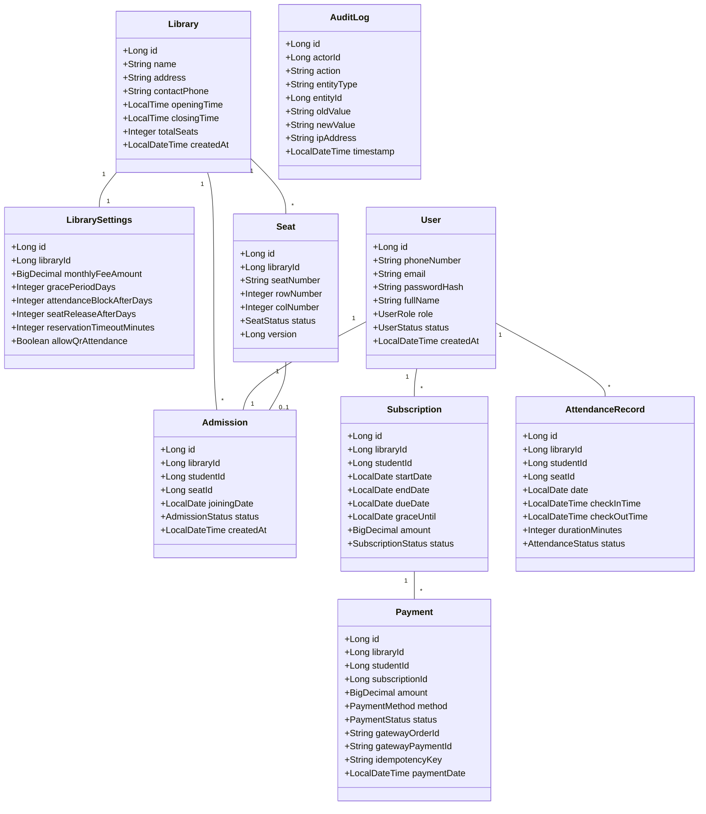

# Digital Library Management System - Low-Level Design (LLD)

## 1. Domain Entities & Class Architecture



---

## 2. Service Interfaces & Key Methods

### 2.1 `SeatReservationService`
```java
public interface SeatReservationService {
    SeatLayoutDto getLibrarySeatLayout(Long libraryId);
    SeatReservationDto reserveSeat(Long libraryId, Long seatId, Long userId);
    void releaseExpiredReservations();
    void confirmSeatBooking(Long seatId, Long studentId);
    void adminChangeSeat(Long libraryId, Long studentId, Long newSeatId, Long adminId);
}
```

### 2.2 `AdmissionService`
```java
public interface AdmissionService {
    AdmissionResponseDto processAdmission(AdmissionRequestDto request);
    AdmissionDetailsDto getAdmissionByStudentId(Long studentId);
    void cancelAdmission(Long admissionId, Long adminId, String reason);
}
```

### 2.3 `AttendanceService`
```java
public interface AttendanceService {
    QrTokenResponseDto generateRotatingQrToken(Long libraryId);
    AttendanceResponseDto checkInWithQr(Long studentId, String qrToken);
    AttendanceResponseDto checkOut(Long studentId);
    Page<AttendanceRecordDto> getStudentAttendanceHistory(Long studentId, Pageable pageable);
    TodayAttendanceSummaryDto getTodaySummary(Long libraryId);
    void adminCorrectAttendance(AttendanceCorrectionDto dto, Long adminId);
}
```

### 2.4 `SubscriptionService`
```java
public interface SubscriptionService {
    SubscriptionDto getActiveSubscription(Long studentId);
    void createInitialSubscription(Long studentId, LocalDate joiningDate, BigDecimal amount);
    void extendSubscriptionForPayment(Long studentId, Long paymentId);
    void processDailyBillingTransitions();
    void grantAdminExtension(Long subscriptionId, LocalDate newGraceUntil, String reason, Long adminId);
}
```

### 2.5 `PaymentService`
```java
public interface PaymentService {
    RazorpayOrderResponseDto createRazorpayOrder(Long studentId, Long subscriptionId);
    PaymentVerificationResponseDto verifyRazorpayPayment(PaymentVerificationRequestDto dto);
    void processRazorpayWebhook(String webhookPayload, String signatureHeader);
    PaymentDto recordCashPayment(CashPaymentRequestDto request, Long adminId);
}
```

---

## 3. Transaction Boundaries & Locks

- **Seat Reservation:** `@Transactional(isolation = Isolation.READ_COMMITTED)` with `PessimisticLockException` retry or explicit `LockModeType.PESSIMISTIC_WRITE` on `SeatRepository.findByIdWithLock(seatId)`.
- **Payment Verification:** `@Transactional` wrapping payment state update, subscription extension, and audit log write.
- **Cash Payment Recording:** Single atomic `@Transactional` method ensuring payment cannot be saved without simultaneously advancing the subscription.
- **Attendance Check-In:** `@Transactional` with `UNIQUE(student_id, date)` checking to prevent concurrent double check-in.
