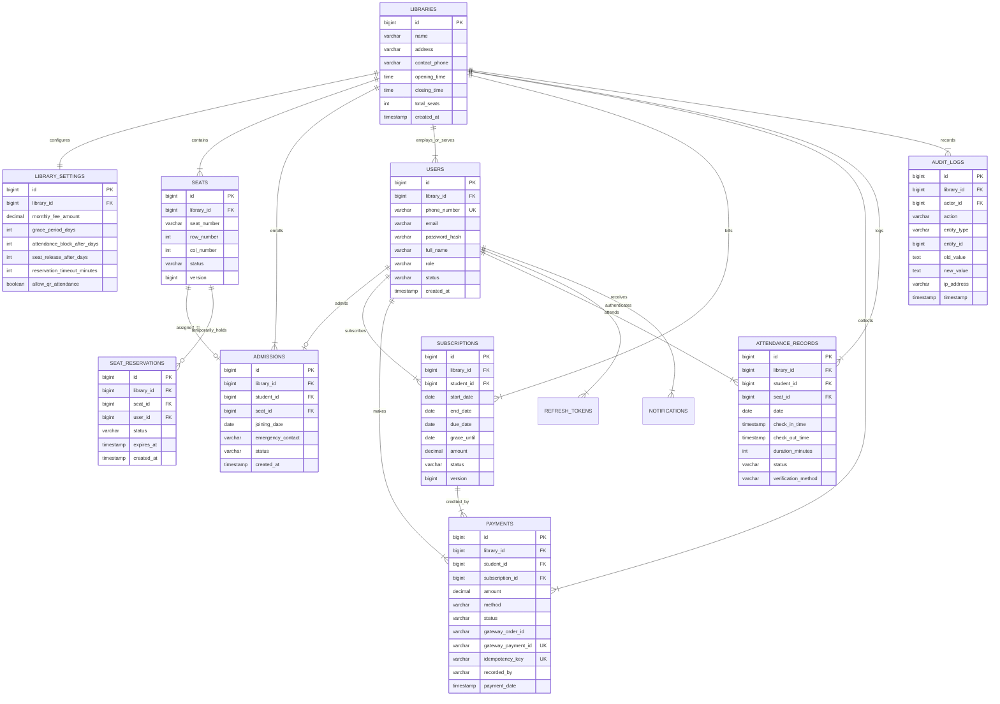

# Digital Library Management System - Entity Relationship Diagram

```mermaid
erDiagram
    LIBRARIES ||--|| LIBRARY_SETTINGS : configures
    LIBRARIES ||--|{ SEATS : contains
    LIBRARIES ||--|{ ADMISSIONS : enrolls
    LIBRARIES ||--|{ USERS : employs_or_serves
    LIBRARIES ||--|{ SUBSCRIPTIONS : bills
    LIBRARIES ||--|{ PAYMENTS : collects
    LIBRARIES ||--|{ ATTENDANCE_RECORDS : logs
    LIBRARIES ||--|{ AUDIT_LOGS : records

    USERS ||--o| ADMISSIONS : admits
    USERS ||--|{ SUBSCRIPTIONS : subscribes
    USERS ||--|{ PAYMENTS : makes
    USERS ||--|{ ATTENDANCE_RECORDS : attends
    USERS ||--|{ REFRESH_TOKENS : authenticates
    USERS ||--|{ NOTIFICATIONS : receives

    SEATS ||--o| ADMISSIONS : assigned_to
    SEATS ||--o{ SEAT_RESERVATIONS : temporarily_holds

    SUBSCRIPTIONS ||--|{ PAYMENTS : credited_by

    LIBRARIES {
        bigint id PK
        varchar name
        varchar address
        varchar contact_phone
        time opening_time
        time closing_time
        int total_seats
        timestamp created_at
    }

    LIBRARY_SETTINGS {
        bigint id PK
        bigint library_id FK
        decimal monthly_fee_amount
        int grace_period_days
        int attendance_block_after_days
        int seat_release_after_days
        int reservation_timeout_minutes
        boolean allow_qr_attendance
    }

    USERS {
        bigint id PK
        bigint library_id FK
        varchar phone_number UK
        varchar email
        varchar password_hash
        varchar full_name
        varchar role
        varchar status
        timestamp created_at
    }

    SEATS {
        bigint id PK
        bigint library_id FK
        varchar seat_number
        int row_number
        int col_number
        varchar status
        bigint version
    }

    SEAT_RESERVATIONS {
        bigint id PK
        bigint library_id FK
        bigint seat_id FK
        bigint user_id FK
        varchar status
        timestamp expires_at
        timestamp created_at
    }

    ADMISSIONS {
        bigint id PK
        bigint library_id FK
        bigint student_id FK
        bigint seat_id FK
        date joining_date
        varchar emergency_contact
        varchar status
        timestamp created_at
    }

    SUBSCRIPTIONS {
        bigint id PK
        bigint library_id FK
        bigint student_id FK
        date start_date
        date end_date
        date due_date
        date grace_until
        decimal amount
        varchar status
        bigint version
    }

    PAYMENTS {
        bigint id PK
        bigint library_id FK
        bigint student_id FK
        bigint subscription_id FK
        decimal amount
        varchar method
        varchar status
        varchar gateway_order_id
        varchar gateway_payment_id UK
        varchar idempotency_key UK
        varchar recorded_by
        timestamp payment_date
    }

    ATTENDANCE_RECORDS {
        bigint id PK
        bigint library_id FK
        bigint student_id FK
        bigint seat_id FK
        date date
        timestamp check_in_time
        timestamp check_out_time
        int duration_minutes
        varchar status
        varchar verification_method
    }

    AUDIT_LOGS {
        bigint id PK
        bigint library_id FK
        bigint actor_id FK
        varchar action
        varchar entity_type
        bigint entity_id
        text old_value
        text new_value
        varchar ip_address
        timestamp timestamp
    }
```
